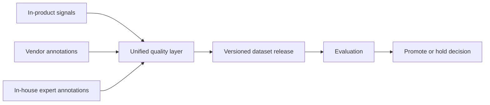
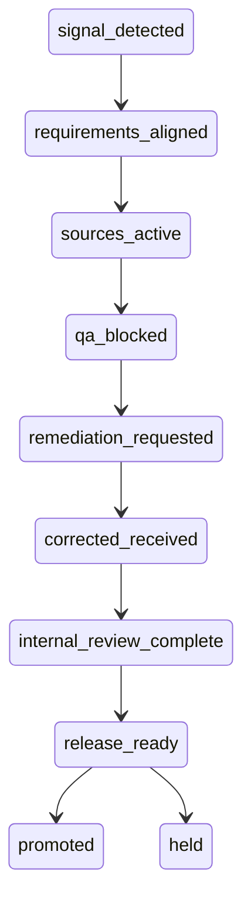
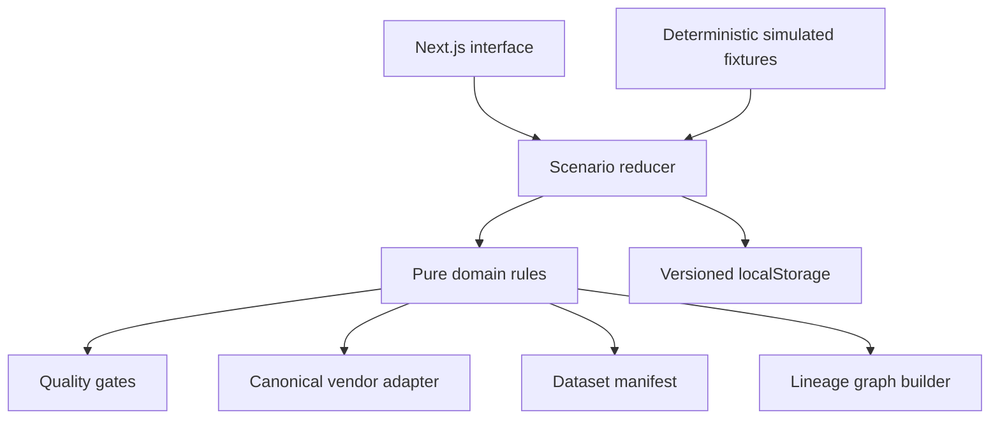

# SignalOps

SignalOps is a standalone ML data-operations control plane prototype. It shows how product feedback, external vendor deliveries, and in-house expert annotations can be converted into a versioned dataset release with explicit quality gates, human accountability, and end-to-end lineage.

The prototype is a deterministic, resettable demonstration. Vendors, people, costs, telemetry, and evaluation results are fictional and visibly marked as simulated. Quality calculations, state transitions, adjudication, manifests, and exports run locally in the browser.

## Guided walkthrough

1. Open **Mission Control** and inspect the active Unexpected Vocals intervention.
2. In **Requirements**, align stale downstream artifacts to requirement v3 and capture a product signal.
3. Activate vendor, in-house, and product sources.
4. In **Vendor Operations**, export the canonical work package and run quality gates against the seeded delivery.
5. Inspect the failed records, record an exception decision, and send remediation.
6. Load the corrected delivery and rerun the gates.
7. Complete the seven tasks in **In-house Review**.
8. Inspect the live graph in **Lineage** and build the dataset release.
9. Review the simulated target and guardrail evaluation, record a rationale, and promote the release.
10. Download the decision manifest or reset the scenario from the navigation.

The complete flow is designed to run in under eight minutes.

## Three-source operating model



## Intervention lifecycle



## Architecture

SignalOps is intentionally static-first:

- Next.js App Router and TypeScript
- React context and reducer for scenario behavior
- Versioned browser persistence with a deterministic reset
- Pure domain functions for adapters, quality gates, scoring, release manifests, and lineage
- React Flow for the live, read-only lineage graph
- Vitest for domain tests and Playwright for the guided path
- No database, credentials, authentication, or external APIs



## Quality framework

The seeded vendor batch is blocked unless all critical gates pass:

| Gate | Threshold |
| --- | ---: |
| Schema validity | 100% |
| Provenance completeness | 100% |
| Duplicate assets | 0 |
| Gold accuracy | ≥ 92% |
| Inter-rater disagreement | ≤ 15% |
| Required slice coverage | At least 2 records per required slice |
| Rubric alignment | 100% on the current rubric |

The first batch contains deliberate schema, duplication, provenance, gold-accuracy, coverage, and rubric-version failures. A corrected batch passes the same calculations. Internal submissions with uncertain labels, low confidence, or calibration disagreement require senior adjudication. Product signals are release-eligible only when they are explicit or clear a 70% confidence threshold.

Vendor scores are calculated from quality (35%), reliability (15%), cost efficiency (15%), throughput (10%), expertise (10%), responsiveness (10%), and improvement velocity (5%). Recommendations are derived from the weighted score and quality trajectory.

## Workflow and adapter model

The executable `rubric-classification` workflow defines its input/output schema, gold threshold, required slices, and human-review rule. The same workflow drives the vendor package and internal review queue.

The registry also includes non-executable examples for pairwise comparison, expert Q&A, multi-output ranking, AI-agent review, and in-product preference collection. They demonstrate the contract shape without calling third-party systems or running arbitrary code.

## Functional and simulated boundaries

Functional:

- Requirement alignment checks
- Vendor work-package generation and delivery normalization
- Record-level quality calculations and blocking decisions
- Exception and internal-expert adjudication
- Vendor scoring and allocation recommendations
- Lifecycle enforcement and audit events
- Eligibility-aware cross-source dataset manifest and lineage graph
- Browser persistence, reset, and manifest export

Simulated:

- People and organizations
- Product telemetry and annotation labor
- Audio previews and model outputs
- Costs, schedules, and evaluation execution

## Seeded scenario

The initial batch contains 48 fictional records, including malformed records, duplicates, invalid provenance, incorrect gold labels, an uncovered required slice, ambiguous examples, and a stale rubric version. Seven records are routed to in-house experts. The corrected batch resolves critical delivery defects while retaining all audit history.

## Local development

```bash
npm install
npm run dev
```

Open [http://localhost:3000](http://localhost:3000).

```bash
npm test
npm run lint
npm run build
npm run test:e2e
```

## Productionization roadmap

1. Replace browser fixtures with authenticated program and artifact APIs.
2. Add immutable object storage, dataset checksums, and signed delivery manifests.
3. Introduce scoped credentials and allow-listed adapters for approved vendor systems.
4. Add organization-level authorization, approval policies, and protected audit retention.
5. Run quality and lineage generation in durable background workflows.
6. Add real evaluation integrations, monitoring, and rollback controls.

## Deferred scope

Authentication, shared sessions, databases, vendor contracting, payments, real AI APIs, visual workflow editing, generic annotation canvases, real model training, and arbitrary integration execution are intentionally excluded.
