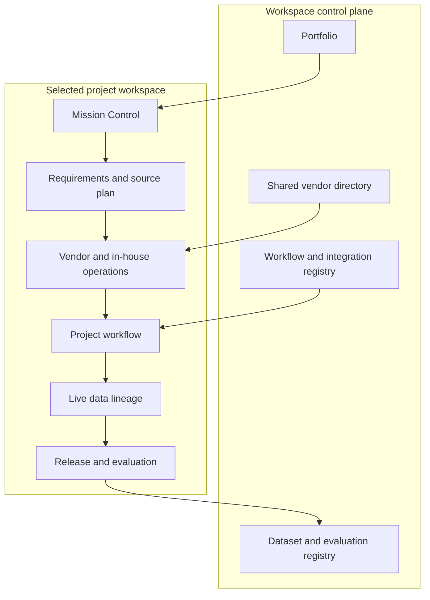
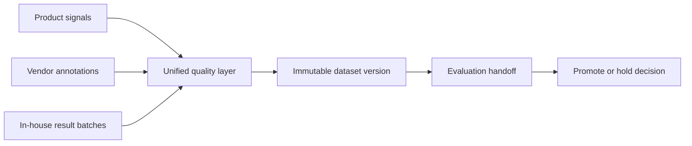
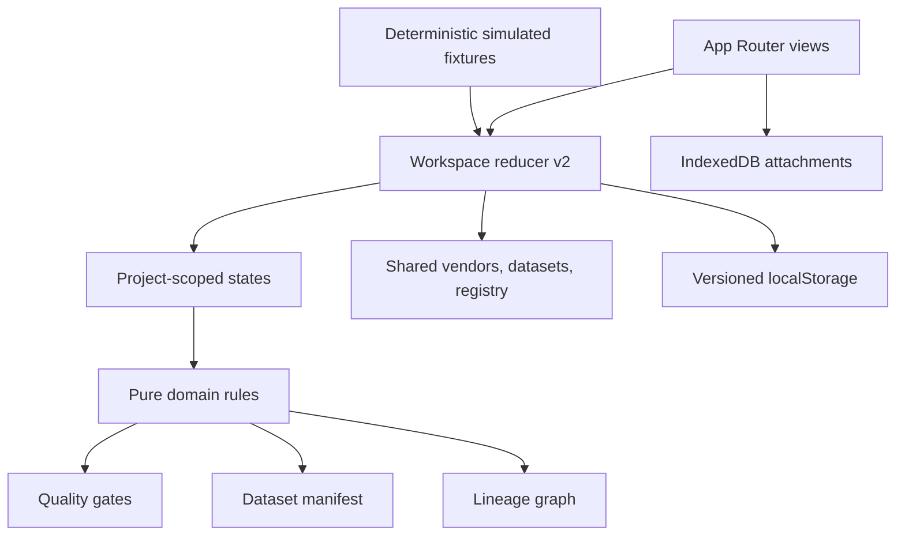

# SignalOps

SignalOps is a browser-local ML data-operations control plane. It separates workspace-wide portfolio management from the operating details of an individual data project, while preserving traceability from requirements and sourcing through QA, datasets, evaluation, and release decisions.

The prototype is deterministic and resettable. Projects, people, vendors, costs, telemetry, reminders, and external connector activity are fictional and visibly marked as simulated. State transitions, quality calculations, version history, aggregate operations, manifests, lineage, downloads, and promotion gates run in the browser.

Public demo: add the deployment URL after publishing.

## Guided walkthrough

1. Open **Portfolio** to compare three seeded projects, filter work that needs attention, change the dashboard preset, or create a planning project.
2. Open **Unexpected Vocals** and customize its Mission Control widgets. The configuration is isolated to this project and persists after refresh.
3. In **Requirements**, upload an original source brief, edit its structured draft, compare published changes, adjust and explicitly save the source plan, inspect its vendor-scorecard match, create a simulated alignment reminder, and publish requirement v4.
4. Confirm the source plan, work package, artifacts, vendor engagement, and workflow stage become stale.
5. In **Operations**, inspect the vendor engagement and both pilot versions. Align the project, activate its sources, and run the planted defective delivery through QA.
6. Record the aggregate exception decision, request remediation, load the corrected delivery, and rerun QA.
7. Review in-house backlog, throughput, SLA, calibration, capacity, team allocation, and defect taxonomy. Synchronize and import the aggregate batch result; no annotation work is performed in SignalOps.
8. Inspect the fixed, clickable **Data Lineage** graph and its linked audit evidence.
9. Build the immutable dataset in **Release & Evaluation**, download the record-level JSON/CSV manifest, create a complete evaluation package, move it through the lifecycle, submit results, and record a promote or hold rationale.
10. Open **Vocal Naturalness Preference** to inspect a second connected management example with a 12,000-record source plan, vendor throughput, aggregate in-house operations, three workflow stages, a candidate dataset, and an evaluation request.
11. Open **Datasets & Evaluations** for the global registry, source evidence, download history, and cross-project evaluation state. In **Registry**, expand any entry to inspect and download its connector contract. Reset the project or entire workspace at any time.

The fully interactive seeded lifecycle is designed to complete in under eight minutes.

## Two-level operating model



Each project combines three distinguishable source paths:



## State and architecture

- Next.js App Router and TypeScript
- Real global and project routes, including `/portfolio`, `/vendors`, `/datasets`, `/registry`, and `/projects/:projectId/*`
- React context and reducer with a versioned `WorkspaceState` schema
- Deterministic v1-to-v2 migration and malformed-state recovery
- `localStorage` for workspace metadata and IndexedDB for attachment blobs
- Pure domain functions for QA, scoring, release manifests, promotion eligibility, and lineage
- React Flow for the read-only project lineage graph
- Vitest for domain behavior and Playwright for the guided browser flow
- No database, authentication, credentials, or external API execution



## Requirement and alignment model

One requirement document library keeps the original brief and supporting source evidence beside its structured interpretation. Requirement edits remain mutable until publishing. Publishing creates an immutable version with author, timestamp, reason, changed fields, and a field-level comparison against the previous version. It automatically marks linked source plans, work packages, rubrics, gold sets, vendor engagements, and workflow stages stale.

Source-plan edits enter an unsaved state and must total 100% before they can be saved. The page exposes planned records, allocation, vendor budget, and a live vendor-scorecard ranking so the sourcing decision is connected to capacity, availability, and vendor performance.

Supported local attachments are `.md`, `.txt`, `.json`, and `.pdf` up to 2 MB. Text and PDF files open in a browser preview; PDFs remain opaque and are not parsed. Reminder delivery is simulated, but recipient, due date, message, status, and audit evidence are functional.

## Quality framework

The seeded vendor delivery is blocked unless all critical gates pass:

| Gate                     |                             Threshold |
| ------------------------ | ------------------------------------: |
| Schema validity          |                                  100% |
| Provenance completeness  |                                  100% |
| Duplicate assets         |                                     0 |
| Gold accuracy            |                                 ≥ 92% |
| Inter-rater disagreement |                                 ≤ 15% |
| Required slice coverage  | At least 2 records per required slice |
| Rubric alignment         |            100% on the current rubric |

The initial 48-record batch contains two duplicates, two malformed records, two provenance failures, sub-threshold gold accuracy, an underrepresented slice, three ambiguous records, and one stale rubric version. A corrected delivery passes the same deterministic gates.

Vendor scorecards expose each underlying metric and weight:

| Factor                | Weight |
| --------------------- | -----: |
| Quality               |    30% |
| Expertise fit         |    15% |
| Response time         |    10% |
| Improvement velocity  |    10% |
| Rapid scaling ability |    10% |
| Reliability           |    10% |
| Cost efficiency       |    10% |
| Throughput            |     5% |

Profiles also show capability tags, modalities, locales, availability, rate band, capacity, utilization, quality trend, project engagements, and detailed pilot history.

## Workflows, integrations, and evaluation

The global registry contains reusable Q&A, pairwise comparison, ranking, rubric classification, AI-agent review, and product-feedback workflow definitions. Integration entries cover an annotation platform, API, webhook, object-storage batch, and product events. Every entry exposes transport, authentication boundary, input/output data, setup steps, and a downloadable connector contract. The registry does not execute arbitrary code or external calls.

Project workflow pages describe an operational data-production contract, not legal terms. They show the assigned version, owner, entry and exit criteria, dependencies, linked artifacts, and current state. Live inputs are populated from project requirements, source plans, engagements, batches, QA, datasets, and evaluation records rather than a free-form status field. Unconfigured projects show an assignment prompt instead of treating a placeholder workflow as active.

Workflow and Release share one release-checkpoint selector. It calculates configuration, delivery quality, in-house work, dataset, evaluation, and decision states, and gives every checkpoint an evidence explanation and trace link. `pending` means required evidence is absent; `active` means work is in progress; `blocked` means a gate failed; `complete` means required evidence passed; `aligned` means an artifact references the current requirement; `stale` means it references an older version; and `not required` means an aligned source plan allocates no work to that path. Portfolio health and external engagement facts remain stored inputs; calculated gates are derived from their underlying records.

Dataset JSON and CSV exports contain one manifest row per record with source, version, QA state, lineage origin, and a simulated object-storage URI. Raw media is not embedded in the browser demo. Production would resolve those URIs through signed object-storage access.

Evaluation handoffs support Research, ML, or both as owners; target metrics, guardrails, slices, due date, method, decision request, and download or simulated-connector delivery. A downloaded handoff includes the full dataset manifest, partition locations, expected result schema, execution instructions, connector endpoint, and callback contract. The enforced lifecycle is:

```text
requested → accepted → running → results_submitted → decision_ready
```

Promotion remains blocked until the immutable candidate passes QA, all required evaluation results and guardrails pass, and a rationale is recorded.

## Functional and simulated boundaries

Functional locally:

- Project creation, editing, switching, filters, and isolated persistence
- Dashboard presets, visibility, and accessible ordering
- Requirement drafts, immutable versions, comparisons, reminders, and attachment storage
- Source-plan draft/save validation, vendor-scorecard matching, and stale propagation
- Vendor scoring, filters, engagements, pilots, QA, remediation, and corrected delivery
- Aggregate in-house batch synchronization, result import, and release gating
- Record-level dataset manifests, JSON/CSV downloads, complete evaluation packages, download history, lineage, and audit evidence
- Evaluation lifecycle, result entry, guardrails, and promote/hold decisions

Simulated:

- Organizations, people, product telemetry, annotation labor, costs, and schedules
- Reminder delivery, annotation-platform synchronization, and connector auto-send
- Research and ML evaluation execution
- Model behavior and release effects

## Local development

```bash
npm install
npm run dev
```

Open [http://localhost:3000](http://localhost:3000).

```bash
npm test
npm run lint
npm run build
npm run test:e2e
```

## Productionization roadmap

1. Replace browser fixtures with authenticated workspace, artifact, vendor, and dataset APIs.
2. Add organization and project authorization, approval policies, and protected audit retention.
3. Move attachment and dataset objects to immutable storage with checksums and signed manifests.
4. Add allow-listed connectors with scoped credentials, idempotent webhooks, retries, and observability.
5. Run QA, lineage generation, and evaluation handoffs in durable background workflows.
6. Add shared sessions, real notifications, annotation-platform integrations, evaluation APIs, monitoring, and rollback controls.

## Deferred scope

Authentication, shared multi-user sessions, databases, contracting, billing, real notifications, PDF extraction, real annotation execution, real AI APIs, visual workflow editing, generic annotation canvases, arbitrary code execution, and model training are intentionally excluded.
